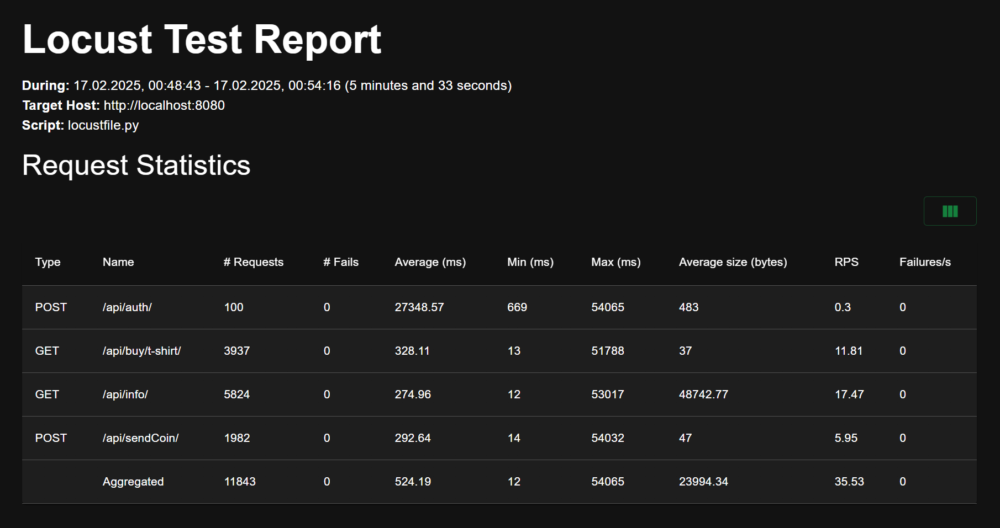

# Магазин мерча (Merch Store Backend)
Сервис позволяет сотрудникам обмениваться монетами и приобретать мерч за виртуальную валюту. Реализован на Django + DRF с использованием PostgreSQL и Docker Compose.

## Функциональность
- Аутентификация через JWT (Simple JWT)
- Баланс монет: просмотр количества монет, отправка монет коллегам
- Покупка товаров: приобретение товаров за монеты
- История транзакций: просмотр полученных и отправленных монет
- REST API на основе Django REST Framework

## Установка и запуск
### 1. Клонируем репозиторий
```bash
git clone https://github.com/progmat64/merch-store-backend.git
cd merch-store-backend
```

### 2. Создаём `.env` файл (если нужно)
Создай файл `.env` в корне проекта:
```ini
POSTGRES_DB=merchstore
POSTGRES_USER=user
POSTGRES_PASSWORD=password
```

### 3. Запускаем Docker
```bash
docker-compose up --build -d
```

### 4. Применяем миграции
```bash
docker-compose exec web python manage.py makemigrations
docker-compose exec web python manage.py migrate
```

### 5. Создаём суперпользователя
```bash
docker-compose exec web python manage.py createsuperuser
```

### 6. Готово
Админ-панель доступна по адресу: [http://localhost:8080/admin/](http://localhost:8080/admin/)

## API Методы
### Аутентификация
`POST /api/auth/` - Получение JWT-токена  
```json
{
    "username": "bob",
    "password": "2244x"
}
```

`POST /api/token/refresh/` - Обновление `access_token`
```json
{
    "refresh": "your_refresh_token"
}
```

### Работа с монетами
`GET /api/info/` - Получение баланса, покупок и истории

`POST /api/sendCoin/` - Отправка монет пользователю
```json
{
    "toUser": "alice",
    "amount": 50
}
```

### Покупка товаров
`GET /api/buy/{item}/` - Купить товар  

```
GET /api/buy/t-shirt/
```

## Нагрузочное тестирование (Locust)

Было проведено нагрузочное тестирование с использованием **Locust**.

### Конфигурация теста:
- **Продолжительность:** 5 минут 33 секунды
- **Количество пользователей:** 100
- **Хост:** `http://localhost:8080`
- **Сценарий:** `locustfile.py`

## Скриншот результатов теста:

